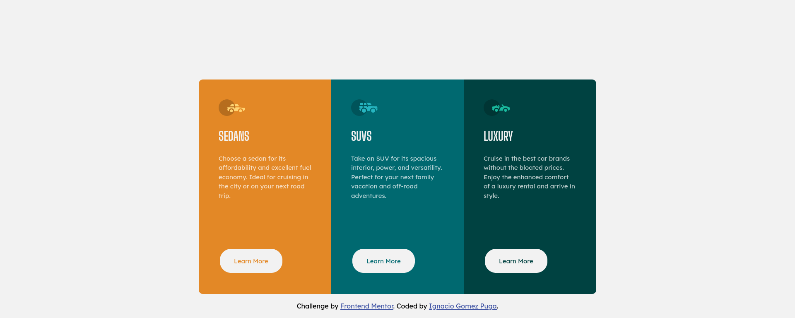

# Frontend Mentor - 3-column preview card component solution

This is a solution to the [3-column preview card component challenge on Frontend Mentor](https://www.frontendmentor.io/challenges/3column-preview-card-component-pH92eAR2-). Frontend Mentor challenges help you improve your coding skills by building realistic projects.

## Table of contents

- [Overview](#overview)
  - [The challenge](#the-challenge)
  - [Screenshot](#screenshot)
  - [Links](#links)
- [My process](#my-process)
  - [Built with](#built-with)
- [Author](#author)

## Overview

### The challenge

Users should be able to:

- View the optimal layout depending on their device's screen size
- See hover states for interactive elements

### Screenshot

### Links

- Solution URL: [GitHub Code](https://github.com/iGomezP/FrontMentorChallenges/tree/main/Challenge3/react_solution)
- Live Site URL: [Netlify Solution](https://frontendmentorch3.netlify.app/)

## My process

### Built with

- Semantic HTML5 markup
- CSS custom properties
- Flexbox
- CSS Grid
- Mobile-first workflow
- [Sass](https://sass-lang.com/)
- [React](https://reactjs.org/) - JS library

## Author

- Website - [GitHub Profile](https://github.com/iGomezP)
- Frontend Mentor - [@iGomezP](https://www.frontendmentor.io/profile/iGomezP)
- Twitter - [@iGomezP](https://twitter.com/iGomezP)
